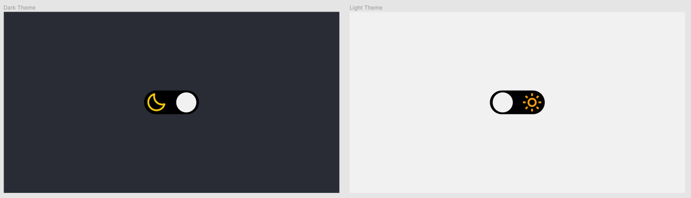
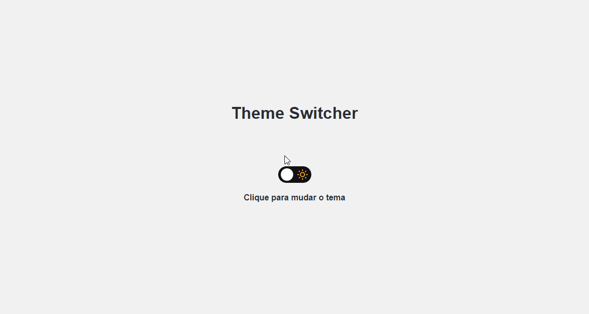

#  Social Tree

## 🎯 Desafio:

Neste desafio, foi proposto a criação de uma página contendo um botão para alterar entre o `Light Mode` e o `Dark Mode`.
 
### Layout disponibilizado

<a href="https://www.figma.com/file/cU57Am8UiYops5VB7g2QFW/DD-%2F-Theme-Switcher-(Copy)">Clique aqui para acessar o layout</a> 
 
## 🚀 Resultado: 
 

## ⚒️ Tecnologias utilizadas:
* Javascript
* CSS
* HTML
